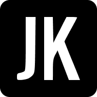

<div align="center">
  <a href="https://junkukim.com">
    
  </a>
  <h2 align="center">Portfolio</h2>
  <p align="center">
    My portfolio website built with <a href="https://nextjs.org">NextJS</a>
    <br />
    <a href="https://junkukim.com">
      <strong>Explore the live website »</strong>
    </a>
  </p>
</div>

### Built with

- 
- 
- 
- 

## Getting Started

This is an instruction of how to set up the project locally. To get a local copy up and running, follow these simple steps.

### Requirements

You must have Node.js and npm installed on your machine. This project was built against the following versions:
 
- Node v16.3.0
- npm v7.15.1

### Installation

To start the project, clone the repository and install dependencies with following command:

```bash
npm install
```

You need to setup environment variables. Create `.env` file and configure necessary variables. Then, start the app by running:

```bash
npm run dev
```

## Browser Support

| Chrome | Firefox |
| :---------: | :---------: |
| Latest &#10003;| Latest &#10003;